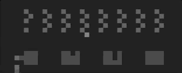

# Gym PyColab

[`gym`](http://gym.openai.com/docs/) interface for [`pycolab`](https://github.com/deepmind/pycolab) games.

<hr/>

<p align="center">
  <p align="center">
    
  </p>
  <p align="center"><i>Extraterrestrial Marauders</i></p>
</p>

```sh
$ pip install gym-pycolab
```

# API

## Example

Inherit from `gym_pycolab.PyColabEnv` to make a `gym.Env` version. Also see [pycolab_games.py](gym_pycolab/pycolab_games.py) for more examples.

```python
import gym_pycolab
from gym import spaces

class MyGameEnv(gym_pycolab.PyColabEnv):
    """A pycolab game env."""

    def __init__(self,
                 max_iterations=10,
                 default_reward=-1.):
        super(MyGameEnv, self).__init__(
            max_iterations=max_iterations,
            default_reward=default_reward,
            action_space=spaces.Discrete(4))

    def make_game(self):
        return my_game

    def make_colors(self):
        return {'#': (0, 0, 255)}

env = MyGameEnv()
state = env.reset()
state, reward, done, info = env.step(0)
```

# Games and Envs

Includes most of the pycolab example games (with `gym.make(game)` or `gym_pycolab.{game}Env(...)`):

+ `Ordeal-v0` ([ordeal](https://github.com/deepmind/pycolab/blob/master/pycolab/examples/ordeal.py))
+ `WarehouseManager-v{0,1,2}` ([warehouse_manager](https://github.com/deepmind/pycolab/blob/master/pycolab/examples/warehouse_manager.py))
+ `FluvialNatation-v0` ([fluvial_natation](https://github.com/deepmind/pycolab/blob/master/pycolab/examples/fluvial_natation.py))
+ `ExtraterrestrialMarauders-v0` ([extraterrestrial_marauders](https://github.com/deepmind/pycolab/blob/master/pycolab/examples/extraterrestrial_marauders.py))
+ `ShockWave-v{0,1}` ([shockwave](https://github.com/deepmind/pycolab/blob/master/pycolab/examples/shockwave.py))
+ `Aperture-v{0,1,2}` ([aperture](https://github.com/deepmind/pycolab/blob/master/pycolab/examples/aperture.py))
+ `Apprehend-v0` ([apprehend](https://github.com/deepmind/pycolab/blob/master/pycolab/examples/apprehend.py))
+ `BetterScrollyMaze-v{0,1,2}` ([better_scrolly_maze](https://github.com/deepmind/pycolab/blob/master/pycolab/examples/better_scrolly_maze.py))
+ `ChainWalk-v0` ([classics/chain_walk](https://github.com/deepmind/pycolab/blob/master/pycolab/examples/classics/chain_walk.py))
+ `CliffWalk-v0` ([classics/cliff_walk](https://github.com/deepmind/pycolab/blob/master/pycolab/examples/classics/cliff_walk.py))
+ `FourRooms-v0` ([classics/four_rooms](https://github.com/deepmind/pycolab/blob/master/pycolab/examples/classics/four_rooms.py))

## Running an Example

Rendering the `ExtraterrestrialMarauders-v0` with random actions:

```sh
$ python -m gym_pycolab.pycolab_games --game extraterrestrial_marauders
```

# Development

Development is started with `pipenv`.

```sh
$ pipenv install
$ pipenv shell
```

# Testing

```sh
$ python -m gym_pycolab.pycolab_env_test
```